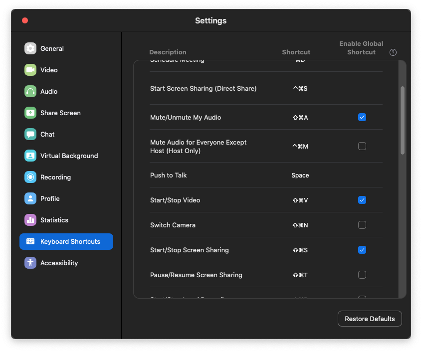

# Stream Deck Zoom Plugin

This is the code for the Zoom Plugin for the Elgato Stream Deck. With this plugin, you can quickly:

* Toggle your mute status
* Toggle your video 
* Toggle sharing; bring up the start share window, or stop sharing
* Bring the Zoom client to the front and focus on it
* Leave a meeting. If you're the host, end the meeting

# Installation

To install this plugin, download the com.lostdomain.zoom.sdPlugin file and double click it to install into the Stream Deck configurator. 

Before adding the actions to your Stream Deck, make sure the following shortcuts are marked as global:

* Mute/Unmute My Audio
* Start/Stop Video
* Start/Stop Screen Sharing

Here's a screenshot of how it should look:

# Technical

The plugin uses