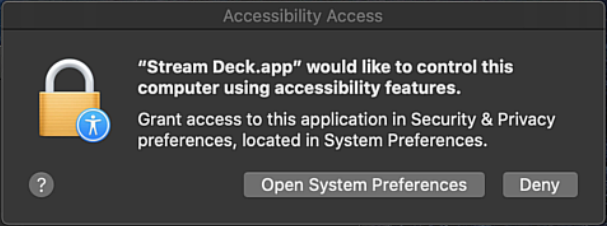
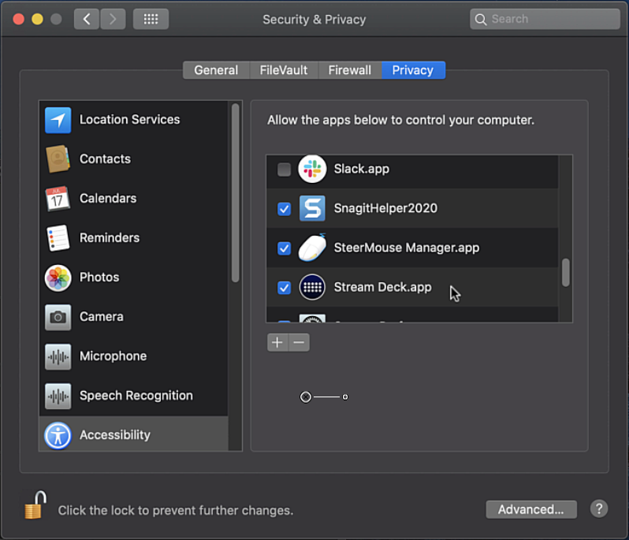
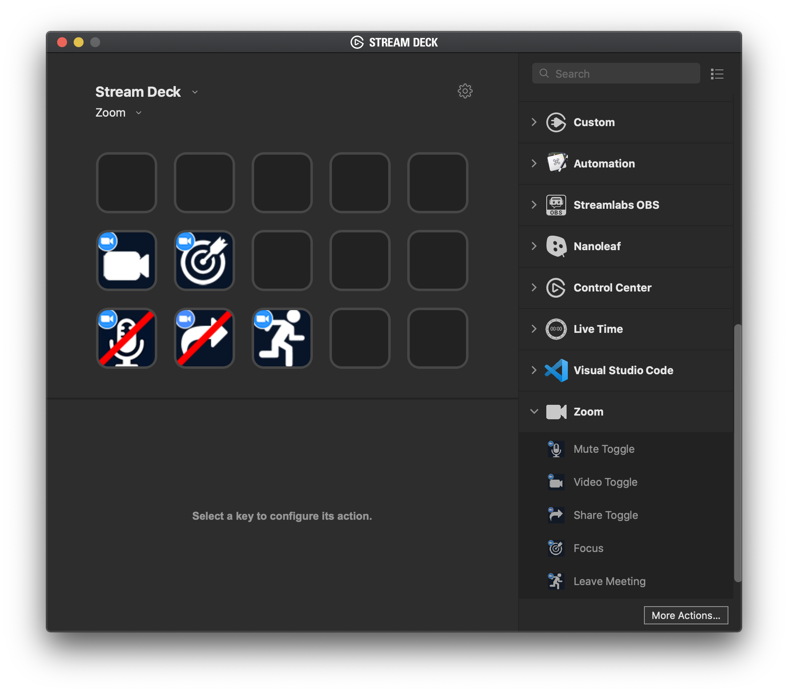

# Stream Deck Zoom Plugin

This is the code for the Zoom Plugin for the Elgato Stream Deck. With this plugin, you can quickly:

* Toggle your mute status
* Toggle your video 
* Toggle sharing; bring up the start share window, or stop sharing
* Bring the Zoom client to the front and focus on it
* Leave a meeting. If you're the host, end the meeting

Currently, this Zoom plugin only works on macOS. It's using AppleScript to detect the status of the buttons and an alternative needs to be figured out for Windows. The code is open for pull requests for anyone who would like to do the Windows part!

# Installation

To install this plugin, download the com.lostdomain.zoom.sdPlugin file and double click it to install into the Stream Deck configurator. 

1. Before adding the actions to your Stream Deck, make sure the following shortcuts are marked as global:

* Mute/Unmute My Audio
* Start/Stop Video
* Start/Stop Screen Sharing

Here's a screenshot of how it should look:

2. Now install the plugin by double clicking the .streamDeckPlugin file. It'll ask for confirmation to install it, click yes.

3. After installing the plugin, it will ask Accessibility permissions, which it needs to control the Zoom client.

4. Make sure Stream Deck is selected in the system preferences:

Now you're ready to add the Zoom actions to your Stream Deck profile of choice and start using it!

# Installation Video

To get a visual view of the installation procedure, check out this video:

